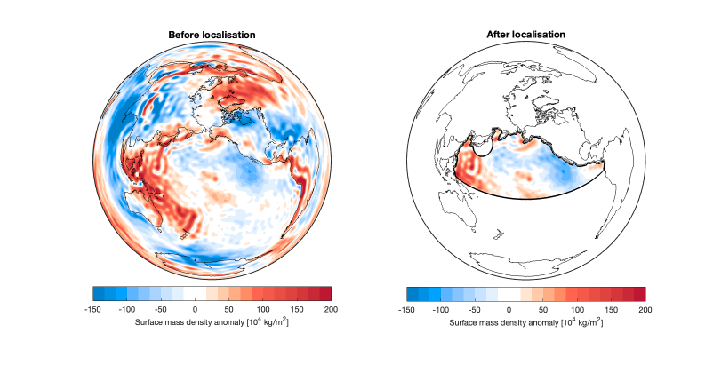

# slepian_ulmo

A fork of csdms-contrib MATLAB repositories dedicated to constructing Slepian functions over ocean basins.
There are also functions for spatial visualisation.

## Functionalities

Functions in this repository may call or overwrite functions from the following packages. Please ensure they are installed and the paths are configured properly before running the functions in this repository.

- [slepian_alpha](https://github.com/csdms-contrib/slepian_alpha.git)
- [slepian_bravo](https://github.com/csdms-contrib/slepian_bravo.git)
- [slepian_delta](https://github.com/csdms-contrib/slepian_delta.git)
- [MatlabColourmapGenerator](https://github.com/williameclee/MatlabColourmapGenerator)

[MatlabColourmapGenerator](https://github.com/williameclee/MatlabColourmapGenerator) is not necessary, but it generates better-looking colours and colourmaps (like the one above).

### Geographic domains

The following ocean basins are supported:

- `oceans`: All oceans, excluding the Arctic Ocean at the moment
- `pacific`: The Pacific Ocean
- `npacific`: The North Pacific Ocean
- `spacific`: The South Pacific Ocean
- `atlantic`: The Atlantic Ocean
- `natlantic`: The North Atlantic Ocean
- `satlantic`: The South Atlantic Ocean
- `indian`: The Indian Ocean
- `arctic`: The Arctic Ocean, which is by default rotated to the equator

The boundaries of these ocean basins are given by the International Hydrographic Organisation (IHO)'s *Limits of Oceans and Seas*.
Differing from the slepian_alpha package, the coastline data in this package is from GSHHG (A Global Self-consistent, Hierarchical, High-resolution Geography Database).

Along with the ocean basins, the following geographic domains are also supported:

- `earthquakes`: A mask of coastal megathrust earthquakes.

A new class is introduced as an interface to geographic domains:

- `GeoDomain`: A class that supports a few new methods that make fetching vertices and defining file names easier.

### Modifications to functions from other packages

The following functions have also been modified (mainly to support `GeoDomain`), and can probably safely replace the original functions:

- `correct4gia` (from slepian_delta) → `correct4gia_new`, although this function should be archived
- `glmalpha` (from slepian_alpha) → `glmalpha_new`
- `grace2plmt` (from slepian_delta)
- `grace2slept` (from slepian_delta) -> `grace2slept_new`
- `integratebasis` (from slepian_delta) → `integratebasis_new` (not fully tested yet)
- `kernelcp` (from slepian_alpha) → `kernelcp_new`
- `plm2slep` (from slepian_bravo) → `plm2slep_new`
- `plm2xyz` (from slepian_alpha)
- `slep2plm` (from slepian_bravo) → `slep2plm_new`
- `slep2resid` (from slepian_bravo) → `slep2resid_new`

The ultimate goal is to drop the `_new` suffixes and replace the original functions with the modified ones. Note that these functions are only tested for geographic domains, and may not work as expected for, e.g. circular caps.

Additionally, `correct4gia` (from slepian_delta) has been split into two functions: `gia2plmt` and `gia2slept`.

### Visualisations

- `eigenwmesh`: Returns a mesh of the eigenvalue-weighted power map of the given Slepian functions.
- `equalearth` and `equalearthd`: Project a longitude-latitude vertex to the Equal Earth projection. 
- `loadbasemap`: Loads an axesm-based map of the given geographic domain.
- `plotqdm`: Plots a quick-and-dirty map (i.e. on a normal axes object) of the given coordinates.

Other supporting functions for visualisation include:
`formatlonticks`, `fotmatlatticks`, `loadcbar`, `loadcmap`, and more.

### Other supporting functions

- `gia2plmt`: Converts GIA data to SH coefficient time series.
- `gia2slept`: Converts GIA data to Slepian coefficient time series.
	The two functions combined replace `correct4gia` from slepian_delta.
- `mascon2slept`: Converts mascon data to Slepian coefficient time series.
- `mass2weq`: Converts mass data to water equivalent.
- `slep2xyz`: Converts Slepian functions to a mesh on a sphere.

---
Last modified by:
- [En-Chi Lee (@williameclee)](https://github.com/williameclee), 2024/08/20
